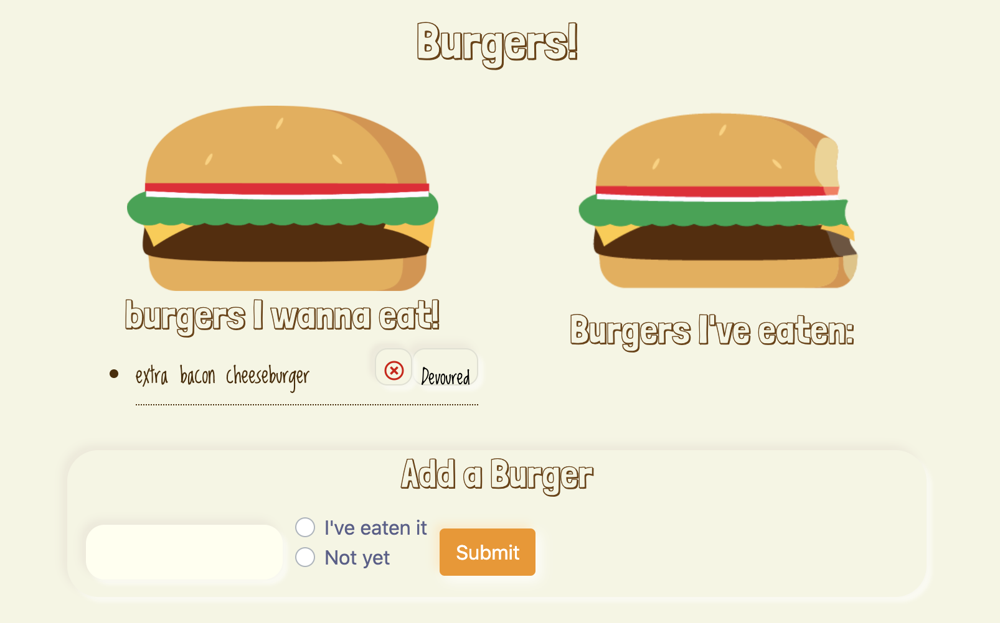

# Burger
A generic restaurant app that lets users input the names of burgers they enjoy eating. Add/Remove, and devour.
*   User enters item(s) they'd like to eat.
*   User then selects if they've eaten it, 'I've eaten it', or if they have not 'not yet'.
*   User then submits it where it is stored in JawsDB MySQL Database.

### User changes
*   User can move item from 'not yet' to 'devoured' by clicking on added item button.

*   User can delete the item from the database by clicking on red 'X'.


## Deployed at
*   https://restaurant-menu-logger.herokuapp.com/
*   using CLI: ```npm start```

## Architecture
**_Wireframe_**
*   Consists of (1) page with a form that goes to either left (if the user has yet to eat it) & the right side if they've eaten the burger.

**_Structure_**
*   Utilizes MySQL, Express-Handlebars.
*   Built using JavaScript.
## Credits
*   Wireframe structure, navigation, and responsiveness developed using **Bootstrap**, https://GetBootstrap.com, version 4.4.1.
*   hamburger images created in Adobe Illustrator, Ricardo Shaffer.


## License
Created using **Boostrap**. MIT License.
